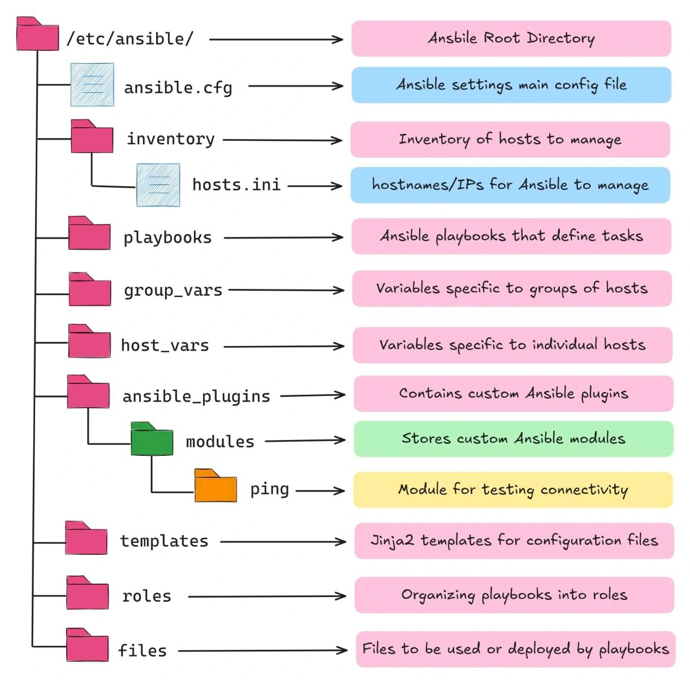

# Ansible Yapılandırma Projesi

Bu proje, Ansible otomasyon aracının standart dizin yapısını ve temel yapılandırma dosyalarını içermektedir.

## Dizin Yapısı

Aşağıdaki resim, bu projede oluşturulan Ansible dizin yapısını göstermektedir:



## İçerik Açıklaması

Projede oluşturulan Ansible yapısı şu bileşenlerden oluşmaktadır:

### `/etc/ansible/` (Ana Dizin)
Ana Ansible dizini, temel yapılandırma dosyalarını içerir.

- **`ansible.cfg`**: Ansible'ın temel davranışlarını belirleyen yapılandırma dosyası.
  ```ini
  [defaults]
  inventory = inventory/hosts.ini
  remote_user = ansible
  host_key_checking = False
  roles_path = roles
  ansible_python_interpreter = /usr/bin/python3

  [privilege_escalation]
  become = True
  become_method = sudo
  become_user = root
  become_ask_pass = False
  ```

### `inventory/` 
Yönetilecek sunucuların listesini içerir.

- **`hosts.ini`**: Sunucuların IP adresleri ve grupları.
  ```ini
  # Web Sunucuları
  [webservers]
  web1.example.com ansible_host=192.168.1.10
  web2.example.com ansible_host=192.168.1.11
  
  # Veritabanı Sunucuları
  [dbservers]
  db1.example.com ansible_host=192.168.1.20
  db2.example.com ansible_host=192.168.1.21
  
  # Uygulama Sunucuları
  [appservers]
  app1.example.com ansible_host=192.168.1.30
  app2.example.com ansible_host=192.168.1.31
  ```

### `playbooks/`
Ansible görevlerini tanımlayan playbook'lar.

- **`webserver_setup.yml`**: Web sunucusu kurulumu için örnek playbook.
  ```yaml
  - name: Web sunucularını yapılandır
    hosts: webservers
    become: true
    tasks:
      - name: Nginx paketini yükle
        apt:
          name: nginx
          state: present
      
      - name: Nginx servisini başlat
        service:
          name: nginx
          state: started
          enabled: yes
  ```

### `group_vars/`
Sunucu gruplarına özgü değişkenler.

- **`webservers.yml`**: Web sunucuları için ortak değişkenler.

### `host_vars/`
Tek bir sunucuya özgü değişkenler.

- **`web1.example.com.yml`**: Web1 sunucusu için özel değişkenler.

### `ansible_plugins/modules/`
Özel Ansible modülleri.

- **`ping/ping_module.py`**: Örnek bir ping modülü.

### `roles/`
Playbook'ları işlevsel olarak gruplamak için roller.

- **`nginx/`**: Nginx sunucu rolü
  - `tasks/main.yml`: Görevleri tanımlama
  - `handlers/main.yml`: Olay işleyicileri
  - `templates/`: Şablonlar (nginx.conf.j2, index.html.j2)
  - `defaults/main.yml`: Varsayılan değişkenler

### `templates/`
Jinja2 şablon dosyaları.

- **`config.json.j2`**: Örnek bir JSON şablon dosyası.

### `files/`
Hedef sunuculara doğrudan kopyalanacak dosyalar.

- **`nginx-site.conf`**: Örnek bir Nginx site yapılandırması.

## Kullanım Örneği

Bir sunucu grubunda playbook çalıştırmak için:

```bash
ansible-playbook -i inventory/hosts.ini playbooks/webserver_setup.yml
```

## Sonuç

Bu Ansible yapısı ile:
- Sunucuları daha kolay yönetebilir
- Otomatik kurulumlar yapabilir
- Yapılandırmaları standartlaştırabilir
- Karmaşık altyapı görevlerini basitleştirebilirsiniz

---
